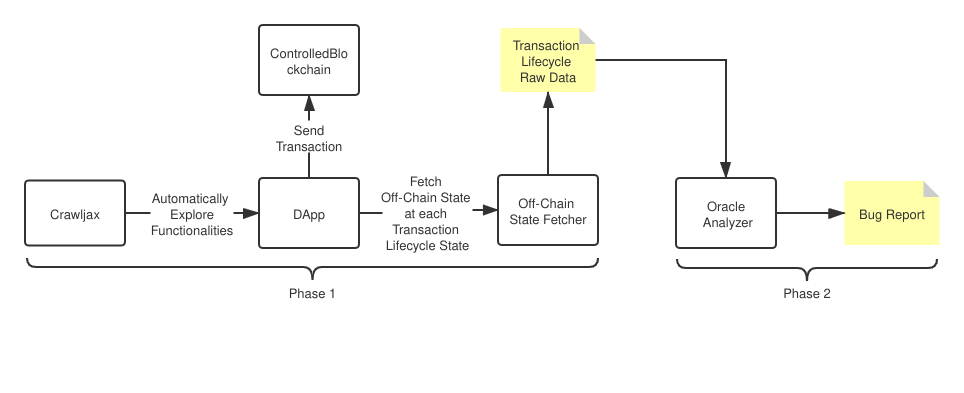

# *ĐArcher* - Detecting On-Chain-Off-Chain Synchronization Bugs in Decentralized Applications 

[](https://doi.org/10.5281/zenodo.4896411)

*ĐArcher* is an automated testing framework aiming to test on-chain-off-chain synchronization bugs in [decentralized applications (DApps)](https://ethereum.org/en/dapps/).

## Introduction

A DApp usually consists of an on-chain layer (smart contracts on blockchain) and an off-chain layer (programs running outside blockchain).
The on-chain layer provides adequate security to the DApp, while the off-chain layer focuses on the performance and user experience. 
The on-chain and off-chain layers cooperate to provide various kinds of high-quality services to ordinary users. 


The consistency between on-chain and off-chain layers of a DApp matters.
The on-chain state updates as transactions are executed on blockchain, while the DApp has to update off-chain state accordingly to make them consistent.
Each transaction has its lifecycle on blockchain, which is quite different from conventionaly transactions (e.g., database transaction), due to the existence of `Pending` and `Reversed` state.

DApps may improperly update the off-chain state during the lifecycle of transactions, inducing inconsistencies between on-chain and off-chain states.
The inconsistencies may result in significant consequences, such as financial loss or make unexpected changes in the DApp.

On-chain-off-chain synchronization bugs refer to those bugs that result in the off-chain state to be inconsistent with the on-chain state.
*ĐArcher* aims to detect these bugs on top of fuzzing with some oracles, as proposed in the paper. 

Using *ĐArcher* to test DApps involves two phases. The workflow of *ĐArcher* is shown as follows:


### Phase 1 - Explore functionalities and collect transaction data

*ĐArcher* leverages [Crawljax](https://github.com/crawljax/crawljax) to automatically explore the functionalities of DApps and initiate transactions. 
For each transaction, *ĐArcher* tries to check whether the on-chain and off-chain states are inconsistent during the lifecycle of the transaction. 

Each transaction will be driven to traverse its lifecycle in the order: `Created` -> `Pending` -> `Executed` -> `Reversed` -> `Executed` -> `Finalized`. 
At each lifecycle state, the off-chain state of the DApp will be fetched and saved for later analysis. 

By the end of functionality exploration using Crawljax, a set of transaction executed will be recorded along with the off-chain states at each transaction lifecycle state. 

### Phase 2 - Analyze transaction data and identify on-chain-off-chain synchronization bugs

An analyzer will be used to apply oracles proposed in the paper on each transaction recorded in Phase 1 to check whether the inconsistencies between on-chain and off-chain states are induced during its lifecycle. 
In fact, here the oracles only use off-chain states to check inconsistencies based on the heuristics explained in the paper. 
This is one of our contributions. 

In the end, a report will be generated, stating during the lifecycle of which transactions the inconsistencies between on-chain and off-chain states occur. 
This indicates the on-chain-off-chain synchronization bugs (the bugs have two types: Type-I and Type-II, respectively) in the DApp. 

Note that *ĐArcher* does not locate bugs in the source code.
*ĐArcher* only identifies transactions, of which the handling program may have bugs to keep on-chain and off-chain states consistent.

For detail explanations, please refer to the preview version of our paper below.

## Publication

See the FSE'21 submission #98 [preview version](./darcher-preview.pdf).

## Installation

### Pre-configured Virtual Machine

Alternatively, we provide a VirtualBox image [here on Zenodo](https://zenodo.org/record/4893187) (please always use the latest version on Zenodo), which contains pre-configured environment of *ĐArcher*.
You can import it into your VirtualBox by following this [tutorial](https://docs.oracle.com/cd/E26217_01/E26796/html/qs-import-vm.html).
Note that the size of the image is huge (approximate 23.2 GB) due to the fact that *ĐArcher* works on integrated testing of Apps, which requires a GUI environment.

The default user of the virtual machine is `darcher` with password `darcher` (in case you need root privilege).
Inside the virtual machine, the *ĐArcher* project is located at `$HOME/darcher`.
All commands below are executed at the root directory of *ĐArcher* project.

### Build from Source

Please check the system requirements: [REQUIREMENTS](./REQUIREMENTS.md)

Clone this project:
```bash
git clone --recurse-submodules https://github.com/Troublor/darcher.git && cd darcher 
```
**Note**: This project contains several submodules. Be sure to add `--recurse-submodules` when git cloning.

Proceed at [INSTALL](./INSTALL.md) for installation of dependencies and compilation.

## Experiment

### DApp Subjects used in the Experiment
- [AgroChain](https://github.com/Kerala-Blockchain-Academy/AgroChain)
- [Augur](https://augur.net/)
- [DemocracyEarth](https://github.com/DemocracyEarth)
- [ETH-Hot-Wallet](https://github.com/PaulLaux/eth-hot-wallet)
- [Ethereum-Voting-Dapp](https://github.com/maheshmurthy/ethereum_voting_dapp)
- [Giveth](https://giveth.io/)
- [Heiswap](https://github.com/kendricktan/heiswap-dapp)
- [MetaMask](https://metamask.io/)
- [Multisender](https://github.com/rstormsf/multisender)
- [PublicVotes](https://github.com/domschiener/publicvotes)
- [TodoList-Dapp](https://github.com/mbeaudru/ethereum-todolist)

### Experiment Results

The results of experiments in the paper are located in the folder
`experiment-results`.
```bash
experiment-results
├── AgroChain
│   ├── AgroChain.report.json
│   └── rounds
│       ├── AgroChain0
│           └── transactions
│               ├── {txhash}.json
│               ├── ...
│       ├── AgroChain1
│       ├── ...
├── Augur
├── ...
```
The structure of the `experiment-result` folder is shown above. 
Each subject has one folder, containing a `.report.json` file and 10 rounds of experiment results (we repeat experiment for each subject for 10 times). 

As mentioned previously, the testing using *ĐArcher* has two phases: 
1. **Phase 1**: Collect transaction data
2. **Phase 2**: Analyze using proposed oracles

#### Result of Phase 1

Results of Phase 1 are located in folder `experiment-result/<subject>/rounds/<subject>[0-9]/transactions`.
The ten sub-folders for each subject represents 10 repeated experiments.
During the experiments, each transaction executed are recorded in a `.json` file in this folder. The `.json` file contains the following things:
- the stack trace of DApp where the transaction is initiated
- the off-chain state of DApp at each transaction lifecycle state
- the console error during the handling of the transaction (used as Baseline-II in the paper)
- the contract vulnerability revealed by the transaction (used as Baseline-I in the paper)

The `.json` file has the following structure: 
```
{
    "hash": transaction hash
    "stack": the stack trace of the DApp where the transaction is initiated
    "states": {
        0: DApp off-chain state when transaction is at `Created` state
        1: DApp off-chain state when transaction is at `Pending` state
        2: DApp off-chain state when transaction is at `Executed` state
        3: DApp off-chain state when transaction is at `Dropped` state
        4: DApp off-chain state when transaction is at `Finalized` state
        5: DApp off-chain state when transaction is at `Reversed` state
        6: DApp off-chain state when transaction is at `Re-executed` state (the second time the transaction reach `Executed` state)
    }
}
```

#### Results of Phase 2

After analyzing the transaction data in Phase 1, an analysis report of all transactions for each DApp subject is put in a `.report.json` file under the folder `experiment-result/<subject>/<subject>.report.json`.  

The report groups the transactions by the stack traces that indicate the corresponding functionalities in the DApp.
In each group, the following things are listed: 
- A list of all transactions with this stack trace.
- A list of transactions that induce runtime errors in the DApp.
- A list of transactions that reveal vulnerabilities in the smart contract on blockchain.
- A list of transactions that are reported by oracles of *ĐArcher* to reveal Type-I or Type-II bugs (see the definitions in the paper) in the DApp.

The structure of the `.report.json` file is shown as follows:
```
{
    "totalRuntimeError": total number of runtime errors in the experiment,
    "totalTransactions": total number of transactions executed in the experiment,
    "totalFunctionalities": total number of distinct stack traces (considered as distinct functionalities of the DApp),
    "functionalities": [
        {
            "stack": the stack trace of this functionality
            "txHashes": the list of transactions invoking this functionality
            "runtimeErrorTxHashes": the list of transactions that induce runtime errors in the DApp
            "vulnerabilityTxHashes": the list of transactions that reveal vulnerabilities in the smart contract
            "BugTypeOneTxHashes": the list of transactions that are reported by ĐArcher as Type-I bugs
            "BugTypeTwoTxHashes": the list of transactions that are reported by ĐArcher as Type-II bugs
        },
        ...
    ]
}
```

### Evaluation Reproduction - Getting Phase 1 Results

To facilitate the experiments on DApps, we have built docker images (publicly available on Docker Hub [here](https://hub.docker.com/u/darcherframework)) for each DApp subject along with the controlled blockchain that traverses the transaction lifecycles. 

**Note**: Before proceeding, please make sure that the `Ethash` and `Chrome Profile` are properly set as stated in [INSTALL](./INSTALL.md#Generate Ethererum DAG)

We provide scripts to start experiments of each DApp with only one command.
```bash
yarn workspace @darcher/examples experiment:<subject>
```
`<subject>` should be substituted with one of the subject names as given above.

The script will first start the docker-compose services of the DApp (the DApp itself and the controlled blockchain). 
Then, a Chrome browser session will be created with the profile configured as [here](./INSTALL.md#Prepare the Chrome Profile).
After that, the experiment will start.

**Note**: Some DApps may take some time to initialize, so it may wait for a while after docker compose services are started. (You may see `Waiting for services in docker ready...` in the console).

Each experiment will take one hour, but you can interrupt the experiment and see partial results. **To interrupt the experiment**, press `CTRL-C` to send `SIGINT` signal. 
If the experiment is interrupted, you need to manually stop the docker-compose services using `yarn workspace @darcher/examples cleanup:<subject>`.

#### Special Case - MetaMask
Since *ĐArcher* depends on MetaMask, when using MetaMask as experiment subject, we need to do some special treatment.
The `ChromeProfile` provided contains three MetaMask extensions: `*ĐArcher* - MetaMask (the dependency of *ĐArcher*)`, `MetaMask (the subject DApp)`, and `dbMonitor (DApp off-chain state fetcher)`.
These two MetaMask extensions conflict with each other.
- When testing other DApp, we need to enable `*ĐArcher* - MetaMask` and `dbMonitor`, disabling `MetaMask`.
- When testing MetaMask, we need to enable `MetaMask`, disabling `*ĐArcher* - MetaMask` and `dbMonitor`.

We have a convenient script `yarn chrome` to open the Google Chrome browser with the profile at `ChromeProfile` folder under root directory.
Disabling and enabling extensions need to be done manually.

### Experiment Output

Each experiment will take 1 hour, and the transactions executed during the experiment will be placed under `./packages/darcher-examples/<subject>/results/<date>` directory.
A `.json` file will be generated for each transaction, as stated in the previous section [Experiment Results](#Experiment Results).

Note that the functionality exploration using Crawljax is a random process. 
The output may not be the same across different runs. 

After the experiment finishes, if the docker-compose services are not stopped automatically, cleanup the services using the following command:
```bash
yarn workspace @darcher/examples cleanup:<subject>
```

At this moment, the results output are only transactions with raw data of off-chain states, i.e., results of **Phase 1**.
We need to further analyze the transactions using the oracles proposed in the paper.
See below.

### Analysis with _ĐArcher_ Oracles - Getting Phase 2 Results

The transactions `.json` files generated in the experiment do not reveal the on-chain-off-chain synchronization bugs in the DApp until the oracle is applied to the off-chain states. 

We provided scripts to analyze the transactions in the `scripts` folder of the root directory. 
The script `./scripts/<subject>.analyze.ts` are TypeScript scripts for each subject.

Previously when off-chain states are fetched at each transaction lifecycle state, all data in the DApp are fetched.
However, some data fields that changes all the time (if considered, the off-chain and on-chain state will always be inconsistent) need to be ignored, e.g., timestamp, to reduce noises in oracle checking.
In each `<subject>.analyze.ts` script, we provide some rules to ignore those data fields if necessary for each DApp, as well as the folder containing the transactions to analyze.

To analyze the transactions of each DApp in `experiment-results` folder, run the follow command:
```bash
yarn analyze:<subject>
```
`<subject>` should be substituted with one of the subject names as given above.
The report (a `.report.json` file) as described as the previous section [Experiment Results](#Experiment Results) shall be generated at the current directory.

**Note**: You may need to change the `dataDir` and `roundDirs` variable in the `<subject>.analyze.ts` to analyze the transactions in your reproduced experiments.